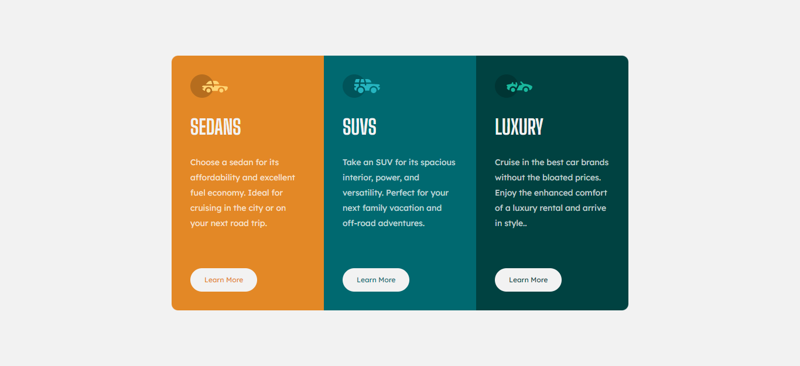

# Frontend Mentor - 3-column preview card component solution

## Bienvenido!! 👋

Esta es la solución a [3-column preview card component challenge on Frontend Mentor](https://www.frontendmentor.io/challenges/3column-preview-card-component-pH92eAR2-). 

## Table of contents

- [Overview](#overview)
  - [The challenge](#the-challenge)
  - [Screenshot](#screenshot)
  - [Links](#links)
- [My process](#my-process)
  - [Built with](#built-with)
  - [What I learned](#what-i-learned)
- [Author](#author)


## Overview

### The challenge

Los usuarios deben ser capaces de:

- Ver el diseño óptimo según el tamaño de pantalla de su dispositivo
- Ver estados de desplazamiento para elementos interactivos

### Screenshot




### Links

- Live Site URL: [franciscojoeldev-3-column-card-component.netlify.app](https://franciscojoeldev-3-column-card-component.netlify.app/)

## My process

### Built with

- Semantic HTML5 markup
- CSS custom properties
- Flexbox
- CSS Grid
- Mobile-first workflow

### What I learned

En este desafío apliqué el uso de Flexbox y Grid CSS, que son herramientas que me permitieron desarrollar el desafío de manera rápida e interactiva, permitiendo que el diseño se ajuste según el tamaño de pantalla del dispositivo de visualización.

```html
<body>
  <main class="principal"></main>
</body>
```
```css
body {
  display: flex;
  justify-content: center;
  align-items: center;
}

.principal {
  display: grid;
  grid-template-columns: repeat(3, 1fr);
}
```

## Author

- Frontend Mentor - [@franciscojoel97](https://www.frontendmentor.io/profile/franciscojoel97)
- Twitter - [@FranciscoJoelC4](https://twitter.com/FranciscoJoelC4)
